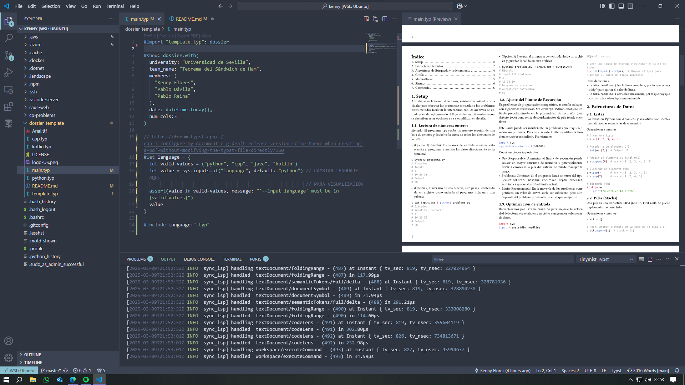
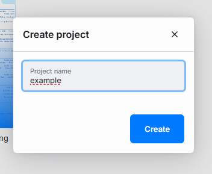
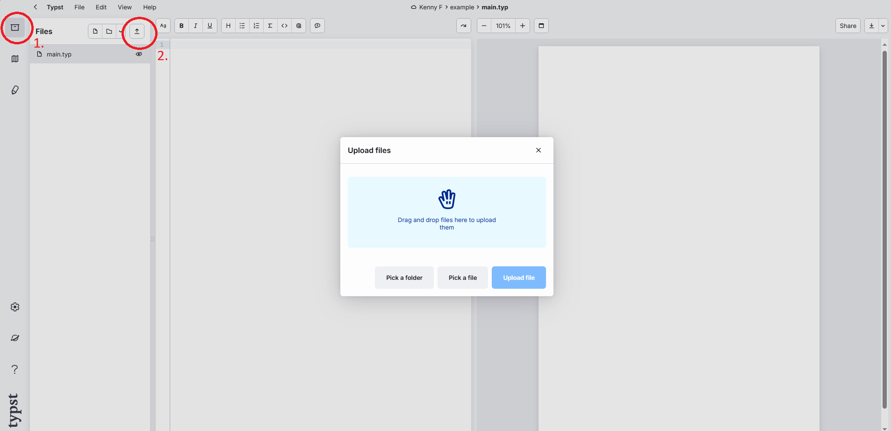
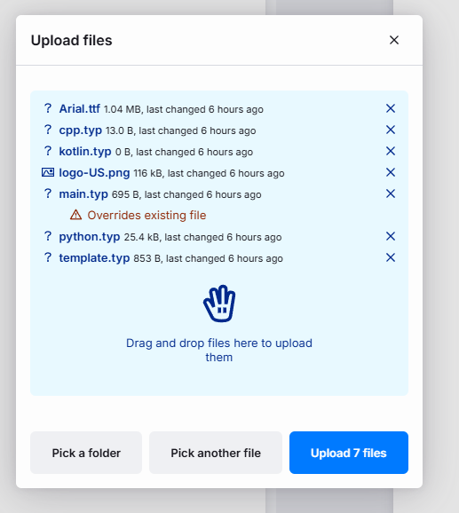

# 📖 Dossier CAUS  

Este dossier es la plantilla oficial del **Club de Algoritmia de la Universidad de Sevilla** para competiciones de programación en **Python**. En el futuro, planeamos extenderlo a más lenguajes.  

Está escrito en [Typst](https://typst.app/), una alternativa a LaTeX desarrollada en Rust, elegida por su velocidad y eficiencia. Optamos por Typst en lugar de LaTeX debido al alto coste computacional de las plantillas tradicionales.  

## 🚀 Cómo usar la plantilla  

### Opción 1: Usar Typst en local  
1. Instala Typst desde su [repositorio oficial](https://github.com/typst/typst), dependiendo de tu sistema operativo. 
2. Clona este repositorio o descárgalo en formato `.zip` y descomprímelo. 
3. Abre tu editor de texto favorito (en este caso usaremos como ejemplo VSCODE)
3. Descarga la extensión [Tinymist](https://github.com/Myriad-Dreamin/tinymist), está disponible en la tienda de VSCODE, aunque también está soportada en editores como NVIM, EMACS, Sublime Text, entre otros.
4. Editar tu proyecto, para ver las visualizaciones, en la esquina superior derecha, pulsar el botón `Tyspt Preview`, os abrirá una pestaña con la visualización en tiempo real.
5. Para cambiar tu lenguaje de programación preferido en el fichero `main.typ` solamente cambiar la linea `let value = sys.inputs.at("language", default: "python")`` por el lenguaje por defecto 

### Opción 2: Usar Typst en la web  

Si no quieres instalarlo de forma local y quieres abrirlo en la página https://typst.app/, seguir los siguientes pasos:

1. Descarga este repositorio en un archivo.zip y descomprímelo en tu ordenador.
2. Accede a [Typst.app](https://typst.app/) e inicia sesión.  
3. Crea un documento nuevo con el nombre que quieras.

  

4. Una vez creado, subimos los ficheros que se descomprimieron y le damos a aceptar.

4. Abre `main.typ` y selecciona el lenguaje de programación deseado, de la misma forma que el paso 5 del usar en local.

## 📜 Licencia  

Al contribuir a este proyecto, aceptas que tu código se publique bajo los términos de la [Licencia MIT](LICENSE.txt).