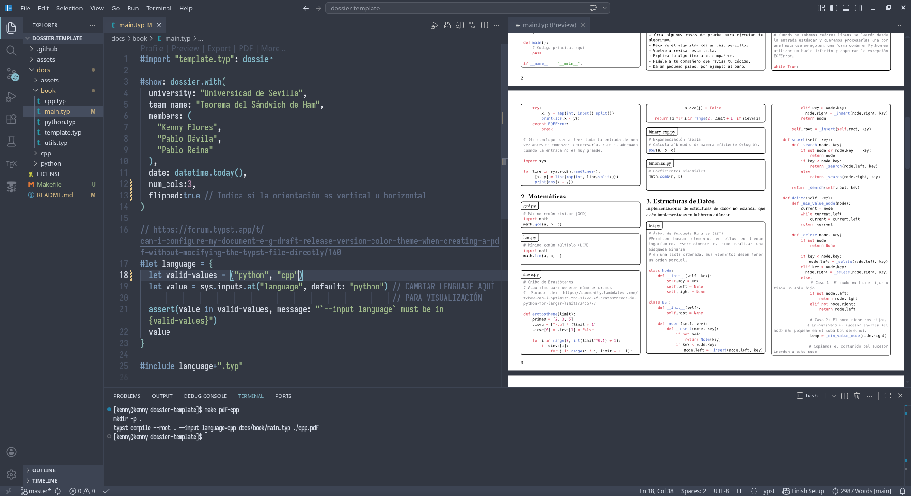

# 📖 Dossier CAUS  

Este dossier es la plantilla oficial del **Club de Algoritmia de la Universidad de Sevilla** para competiciones de programación en **Python**. En el futuro, planeamos extenderlo a más lenguajes.  

Está escrito en [Typst](https://typst.app/), una alternativa a LaTeX desarrollada en Rust, elegida por su velocidad y eficiencia. Optamos por Typst en lugar de LaTeX debido al alto coste computacional de las plantillas tradicionales.  


## Estructura de directorios

```
dossier-template/
├── Makefile                 # Automatiza tareas de compilación, pruebas, etc.
├── stress-tests/            # Directorio de pruebas
│   ├── cpp/
│   └── python/
├── docs/                    # Todo lo que genera el dossier
│   ├── assets/              # Logo e imágenes
│   ├── book/                # Archivos Typst (main, template, utils)
│   ├── cpp/                 # Solo el código en C++
│   └── python/              # Solo el código en Python 3
└── .github/                 # CI/CD para compilar y testear
```


## 🚀 Cómo usar la plantilla  

Recomendamos utilizar la extensión [Tinymist](https://github.com/Myriad-Dreamin/tinymist). Está disponible para VS Code, NVIM, EMACS y Sublime Text entre otros. Gracias a esta extensión podrás compilar los documentos y contarás con una vista previa en tiempo real mientras editas el código. En el caso de VS Code esto se consigue al pulsar el botón `Tyspt Preview` en la esquina superior derecha.




## 🛠️ CI (GitHub Actions)

Cada **push** o **pull request** al repositorio ejecuta los *stress tests*, compila los PDF con Typst y sube los resultados como **artefacto** de la ejecución del workflow.

Los PDF **no se versionan** en el repositorio. Para publicar una versión estable, crea y sube un **tag**. El mismo workflow adjuntará `cpp.pdf` y `python.pdf` a una nueva [**Release**](https://docs.github.com/en/repositories/releasing-projects-on-github/about-releases) de GitHub asociada a ese tag.

## 📜 Licencia  

Al contribuir a este proyecto, aceptas que tu código se publique bajo los términos de la [Licencia MIT](LICENSE.txt).
